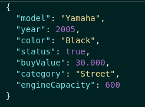

<h1>Car Shop</h1>

  Car Shop is a CRUD API built using NodeJS, Express, MongoDB, Mongoose and TypeScript. MSC architecture (Models, Services, 
  Controllers) was applied in this project.The purpose of this application is to pratice POO and BDD. It was developed writting
  first services test and then writting the route. 
  
  The project was developed in a docker environment.

  The user is able to: 
  -  register cars and motorcycles;
  -  find cars and motorcycles;
  -  update cars and motorcycles informations;
  -  delete cars and motorcycles;
 

<h2> Built With </h2>

 <a href="https://nodejs.org/en/" rel="nofollow"> - NodeJS </a>   
 <a href="https://expressjs.com/pt-br/" rel="nofollow"> - Express </a>   
 <a href="https://www.mongodb.com/" rel="nofollow"> - MongoDB </a>   
 <a href="https://mongoosejs.com/" rel="nofollow"> - Mongoose </a>   
 <a href="https://www.docker.com/" rel="nofollow"> - Docker </a>   
 <a href="https://www.typescriptlang.org/" rel="nofollow"> - TypeScript </a>   

<h2>Endpoints</h2>

<h3> Cars: </h3>

<h3> - GET  </h3>
 
<strong> /cars </strong>

 Get all cars 

<strong> Parameters: No parameters </strong>   

<strong> Response: </strong>

 Status: 200 

 
 

<strong> /cars/:id </strong>

 Get car by id 

<strong> Parameters: No parameters </strong>   

<strong> Response: </strong>

 Status: 200 

 Status: 404 

 - { message: "Car not found" } 

 Status: 422 

 - { message: "Invalid mongo id" } 

 
 

<h3> - POST  </h3>

<strong> /cars </strong>

 Register a new car 

<strong> Parameters:</strong>

 -body 

<strong> Response: </strong>

 Status: 201 

 
 

<h3> - PUT  </h3>
 
<strong> /cars/:id </strong>

 Update a car 

<strong> Parameters:</strong>

 -body 

<strong> Response: </strong>

 Status: 200 

 Status: 404 

 - { message: "Car not found" } 

 Status: 422 

 - { message: "Invalid mongo id" } 

 
 

<h3> - DELETE  </h3>
 
<strong> /cars/:id </strong>

 Delete a car 

<strong> Parameters: No parameters </strong>   

<strong> Response: </strong>

 Status: 204 

 No return

 Status: 404 

 - { message: "Car not found" } 

 Status: 422 

 - { message: "Invalid mongo id" } 

 
 
 

<h3> Motorcycles: </h3>

<h3> - GET  </h3>
 
<strong> /motorcycles </strong>

 Get all motorcycles 

<strong> Parameters: No parameters </strong>   

<strong> Response: </strong>

 Status: 200 

 
 

<strong> /motorcycles/:id </strong>

 Get motorcycles by id 

<strong> Parameters: No parameters </strong>   

<strong> Response: </strong>

 Status: 200 

 Status: 404 

 - { message: "Motorcycles not found" } 

 Status: 422 

 - { message: "Invalid mongo id" } 

 
 

<h3> - POST  </h3>

<strong> /motorcycles </strong>

 Register a new motorcycle 

<strong> Parameters:</strong>

 -body 

<strong> Response: </strong>

 Status: 201 

 
 

<h3> - PUT  </h3>
 
<strong> /motorcycles/:id </strong>

 Update a motorcycle 

<strong> Parameters:</strong>

 -body 

<strong> Response: </strong>

 Status: 200 

 Status: 404 

 - { message: "Motorcycles not found" } 

 Status: 422 

 - { message: "Invalid mongo id" } 

 
 

<h3> - DELETE  </h3>
 
<strong> /motorcycle/:id </strong>

 Delete a motorcycle 

<strong> Parameters: No parameters </strong>   

<strong> Response: </strong>

 Status: 204 

 No return

 Status: 404 

 - { message: "Motorcycles not found" } 

 Status: 422 

 - { message: "Invalid mongo id" } 

 
 
 

<h2>
  How try the application?
</h2>

  Using docker (version 1.29 > is required):   
   1. First run in your terminal <code>docker-compose up -d</code> to up containers.  
   2. Then use the command <code>docker exec -it car_shop bash</code> to acess the container terminal.  
   3. After it use  <code>npm install</code> to install all dependences.  
   4. Run <code>npm run dev</code> on container terminal to start the application. 
   5. If you don´t have any client extension to do the requestions download <code>Thunder Client</code> extension on VS Code. 
   6. Select the method on thunder client. 
   7. Do requisitions on thunder client using the URL shape http://localhost:3001/endpoint.

  Make sure that all containers are up and the ports 3001 and 27017 of your computer are available

 
 

<h2>
  How to run tests?
</h2>

   1. First run <code>npm install</code> to install all dependences.  
   2. Run <code>npm run test:mocha</code> in your terminal to run all tests. 

 
 
  

 Any questions or suggestions? Contact me 

